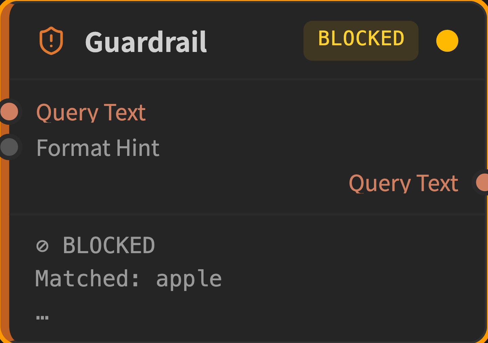
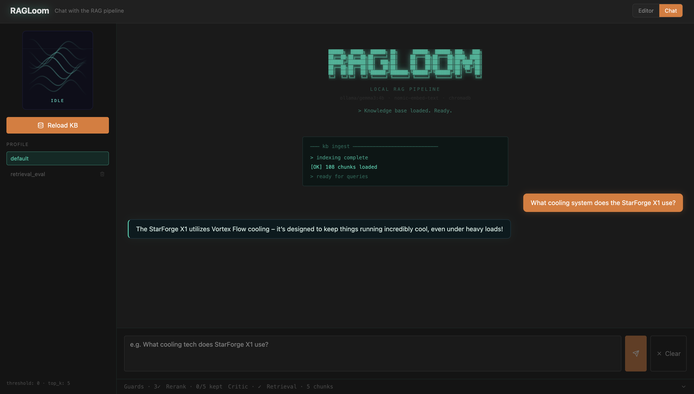
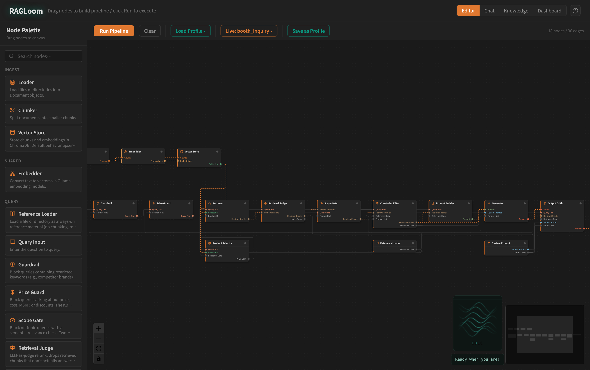
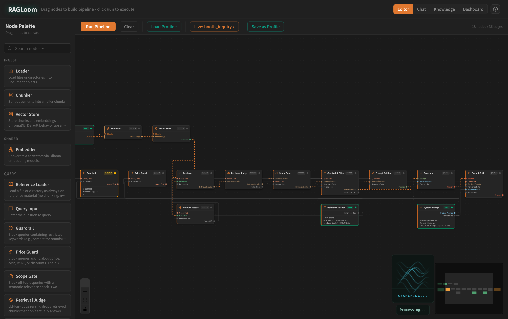

# RAGLoom

**Visual RAG pipeline editor for local, on-device product Q&A.**

A locally-hosted RAG (Retrieval-Augmented Generation) system for product Q&A. Drop in product spec documents, ask questions in natural language, and get grounded answers — generated entirely on-device with no cloud dependencies.

Built with Python, FastAPI, React, ChromaDB, and Ollama. No LangChain.

## Features

- **Visual node editor** — drag-and-drop pipeline building with real-time per-node execution status pushed over WebSocket. Twenty-four node types across **ingest**, **query**, and **eval** categories — seventeen for the chat pipeline plus seven retrieval-quality / inspection eval nodes.
- **Safety Guardrail** — keyword-based pre-retrieval filter that blocks queries matching a configurable block list (e.g. competitor brand names) before they ever reach the LLM. In the node view, blocked queries short-circuit downstream nodes with an amber status ring.
- **ScopeGate** — semantic-relevance check that compares the query embedding to on/off-topic anchor phrases living outside the knowledge base. Off-topic queries (pets, recipes, finance, etc.) short-circuit with a canned refusal — no LLM call, no fabricated catalog. Robust to bridge attacks like "is the dog like a laptop?" where retrieval scores alone can't distinguish on- vs off-topic.
- **PriceGuard** — pre-retrieval pattern match for price-intent queries (`price`, `cost`, `MSRP`, `how much`, `售價`, `多少錢`, etc.) that short-circuits to a canned bilingual refusal. Mirrors `Guardrail` and `ScopeGate`: at small-model scale, "trust the model to follow instructions" is unreliable for high-stakes refusals — the policy is enforced in code instead.
- **ConstraintFilter** — a deterministic, no-LLM numeric spec gate for queries like "under 1kg" or "battery over 20 hours". A small model can't reliably *compare* numbers (it will recommend a 1.8kg laptop for "under 1kg"), so the constraint is enforced in code: a regex extracts `spec / op / value`, each candidate's `product_id` is resolved to its canonical spec from the reference table, and violators are dropped — from both the retrieved chunks **and** the always-on reference rows, so a violating product can't slip back in via the reference block. Supports weight (kg), screen (inch), battery (hr), RAM (GB), and storage (GB/TB); RAM vs storage are disambiguated by nearby keyword since both use GB. If the constraint filters out *every* product, it short-circuits with a canned bilingual refusal (mirroring `Guardrail` / `ScopeGate` / `PriceGuard`) rather than handing the model an empty context to hallucinate over. No-op when the query states no numeric constraint.
- **OutputCritic** — an optional second LLM pass that audits the generator's answer against a negative-rules list. `audit` mode labels violations; `revise` mode rewrites the offending answer.
- **Persona presets** — the `SystemPrompt` node ships with `professional` and `chatbot` presets (plus free-form custom text), both tuned to a trade-show promoter register (2–4 sentences, lead with the hook). The `chatbot` preset emits structured JSON `{reply, emotion}` enforced by Ollama grammar-constrained decoding, which the UI smart-renders as an emotion badge plus a reply bubble with an animated avatar. The avatar is themeable — every theme implements one `AvatarProps` contract and the active theme is chosen at a single swap point (`frontend/src/components/avatar/Avatar.tsx`), so swapping the look is a one-line re-export; the default ships the `silk-flow` theme. Replies are always in the visitor's language.
- **Always-on reference data** — the `ReferenceLoader` node loads a static reference file (e.g. a product comparison CSV) and injects it directly into every prompt, guaranteeing broad coverage for comparison queries independent of vector retrieval results.
- **Metadata-filtered retrieval** — product documents are tagged with a `product_id` at ingest time (derived from filename). The `Retriever` node accepts a filter parameter to scope retrieval to a single product. The `ProductSelector` node, included in the default pipeline, classifies query intent in one of two modes — `rule` (fast string matching against the collection's `product_id`s, zero LLM latency) or `llm` (small LLM pass for ambiguous phrasing) — and feeds the filter automatically. Comparison or unrecognized queries fall through to broad search.
- **Inline editing** — the `QueryInput` node lets you type the question directly on the node; no config panel round-trip.
- **Golden-set eval with LLM-as-judge** — `python -m eval.runner --llm-judge` runs a curated regression set through the pipeline and audits each answer with a second LLM call that returns explicit `hallucinated_claims` lists. Gates on the binary signal (claim list empty / non-empty) rather than noisy float scores so same-commit reruns don't flip pass/fail. See [Eval Harness](#eval-harness) below.
- **Retrieval-quality eval inside the editor** — a dedicated `eval` node family (`EvalCaseLoader`, `CoverageMetric` (Hit@K), `ScoreDistributionMetric`, `DiversityMetric`, `FactsCoverageMetric`, `EvalReport`) and a **Run Batch** button that sweeps any graph across a selected scope of golden-set cases (all / by category / by id list) and renders macro averages, per-category breakdown, worst-K, and a per-case table. A ready-to-load `retrieval_eval` profile ships with the guard stack pre-wired, so you can drop in a graph variant and observe its retrieval behaviour without touching the chat path.
- **Hardened local API** — all `/api/*` endpoints require an `X-Local-Token` that the backend auto-generates on startup (written to `.env.local`, injected transparently by the Vite dev proxy), CORS is restricted to the local origin, and graph file-path params (`source_path`, `persist_path`, `golden_set_path`) are confined to an allowlist of project directories. Batch eval is bounded (≤ 50 cases, ≤ 100 nodes, 600s timeout) so a single request can't exhaust the local LLM. The point: a stray browser tab on a malicious site can't drive your local pipeline.



## Architecture

```
Ingest:  Document → Loader → Chunker → Embedder → VectorStore (ChromaDB)

Query:   Question
            │
   Guardrail (brand keywords) ─ hit ─► canned refusal
            │
            ▼
   PriceGuard (price intent) ─ hit ─► canned refusal
            │
            ▼
   ProductSelector ─ product_id ─► Retriever
   (rule | llm)                       │
                                      ▼
                            RetrievalJudge (LLM rerank — drop off-target chunks)
                                      │
                                      ▼
                            ScopeGate (semantic off-topic) ─ hit ─► canned refusal
                                      │
                                      ▼
                            ConstraintFilter (numeric spec) ─ all dropped ─► canned refusal
                                      │
                                      ▼
                              PromptBuilder ──► Generator ──► OutputCritic ──► Answer
                                   ▲                 ▲
                            ReferenceLoader     SystemPrompt
                            (always-on ref)   (persona + format)
```

Four code-level enforcement points — `Guardrail`, `PriceGuard`, `ScopeGate`, `ConstraintFilter` — short-circuit with canned refusals before reaching the generator. Each fires on a different signal (competitor keywords / price intent / semantic off-topic / no product satisfies a numeric constraint) and they compose without overlap. The first three are pre- or post-retrieval *gates*; `ConstraintFilter` also doubles as a per-candidate filter, only refusing when it empties the candidate set. The common thread: at small-model scale, "trust the model to follow instructions" is unreliable for high-stakes refusals and numeric comparison, so the policy lives in code.

### Core Modules

| Module | Description |
|--------|-------------|
| `core/loader.py` | Reads `.txt`, `.md`, `.csv`, `.pdf` files; derives `product_id` metadata from filenames matching `product_*.{ext}` |
| `core/chunker.py` | Fixed-length, section-based, and CSV row chunking |
| `core/embedder.py` | Generates embeddings via Ollama API |
| `core/vector_store.py` | ChromaDB persistent storage and retrieval |
| `core/retriever.py` | Semantic search with keyword boosting |
| `core/retrieval_judge.py` | LLM-as-judge rerank — drops retrieved chunks that don't actually answer the query (catches polarity/negation misses pure cosine retrieval can't); one batched LLM call per query, degrades to keep-all on judge error |
| `core/guardrail.py` | Keyword-based query filter with word-boundary matching |
| `core/scope_gate.py` | Semantic on/off-topic check via anchor embeddings (default mode) or retrieval-score threshold |
| `core/price_guard.py` | Regex-based price-intent detector + canned bilingual refusal; short-circuits before retrieval |
| `core/constraint_filter.py` | Deterministic numeric spec gate — regex extracts `spec/op/value`, resolves each candidate's `product_id` to its canonical spec, drops violators from retrieved chunks and reference rows; raises `ConstraintBlocked` (canned refusal) when every product is filtered out |
| `core/prompt_builder.py` | Context assembly (RAG results + glossary + vision) |
| `core/personas.py` | Persona presets (professional / chatbot / custom) |
| `core/generator.py` | Calls Ollama LLM for answer generation |
| `core/critic.py` | Second-pass self-critique (audit / revise modes) |
| `core/product_selector.py` | LLM-based intent classifier that maps a query to a single `product_id` (or `NONE` for ambiguous/comparison queries) |
| `core/product_matcher.py` | Rule-based intent classifier — word-boundary regex match (CJK-aware via `re.ASCII`) against `product_id`s. Used by the chat pipeline and the `ProductSelector` node's `rule` mode for zero-latency point-query routing. |
| `core/pipeline.py` | Orchestrates `ingest()` and `query()` for the chat interface |
| `core/eval_metrics.py` | Pure-compute helpers for the Editor eval nodes — coverage / score distribution / diversity / facts coverage / batch aggregation. Mirrors `eval/scorer.py` algorithms so node and CLI eval give matching numbers. |
| `core/path_guard.py` | Confines graph file-path params (`source_path`, `persist_path`, `golden_set_path`) to an allowlist of project roots |
| `config/settings.py` | Dataclass-based config with `.env` override support |

## Interfaces

**Chat UI** — for end users. Type a question, get a formatted answer with a retrieval details panel showing which document chunks were used. Blocked queries surface with an amber `⊘ Blocked by Guardrail` label. In chatbot mode, the avatar reflects the LLM's self-reported emotion from the structured JSON output. Replies are always in the visitor's language.



**Node Editor** — for builders and operators. Drag-and-drop pipeline editor with twenty-four node types grouped into `ingest`, `query`, and `eval` categories — including `Guardrail`, `ScopeGate`, `RetrievalJudge`, `ConstraintFilter`, `SystemPrompt`, `OutputCritic`, `ReferenceLoader`, `ProductSelector`, and the eval family (`EvalCaseLoader`, four metric nodes, `EvalReport`, and `JudgeTraceInspector` — an observation-only sink that surfaces the Retrieval Judge's per-chunk keep/drop verdicts). Real-time per-node execution status over WebSocket. The `ResultDisplay` node smart-renders chatbot JSON into an emotion badge plus reply text. Profiles save/load full graphs, and a **Run Batch** button appears whenever the canvas contains an `EvalCaseLoader`, opening a scope selector + results modal that drives the [editor batch eval](#editor-batch-eval) endpoint.



When a Guardrail keyword match blocks a query, downstream nodes short-circuit visibly across the graph — a PM can point at the safety layer mid-demo:



## Requirements

- Python 3.10+
- Node.js 18+
- [Ollama](https://ollama.com/) running locally

### Ollama Models

```bash
ollama pull gemma3:4b
ollama pull nomic-embed-text
```

### Python Dependencies

```bash
pip install fastapi uvicorn pydantic chromadb requests
# Optional: PDF support
pip install pymupdf
```

### Frontend Dependencies

```bash
cd frontend
npm install
```

## Quick Start

```bash
# 1. Clone & setup
git clone https://github.com/Tsoleou/RAGLoom.git
cd RAGLoom

# 2. Start Ollama
ollama serve

# 3. Start the backend
uvicorn api.server:app --reload --port 8000

# 4. Start the frontend (separate terminal)
cd frontend
npm run dev
```

Open `http://localhost:5173` to access the UI. Use the top-right switcher to toggle between **Editor** (node view) and **Chat** (end-user view).

> **Start the backend before the frontend.** On first launch the backend generates a local API token and writes it to `.env.local`; the Vite dev server reads it (`VITE_API_TOKEN`) and injects it as an `X-Local-Token` header on every `/api` request. All `/api/*` endpoints require this token, so if you started Vite before the token file existed, restart Vite after the backend prints `Generated API token`. To call the API directly (curl / Postman), pass the token from `.env.local` as an `X-Local-Token` header.

## Knowledge Base

Place product documents in the `knowledge_base/` directory. Supported formats: `.txt`, `.md`, `.csv`, `.pdf`. The pipeline auto-selects a chunking strategy based on file type.

Files matching `product_*.{ext}` are automatically tagged with a `product_id` metadata field (derived from the filename) at ingest time, enabling metadata-filtered retrieval.

Place always-on reference files (e.g. a product comparison CSV) in `knowledge_base/_reference/`. These are loaded at startup and injected directly into every prompt — they are not indexed in the vector store.

## Eval Harness

A small golden-set regression suite lives in `eval/`. Each case in `eval/golden_set.json` declares a question, expected language, optional expected `product_id`, expected facts (keyword recall), and optional `expected_blocked` for guardrail behaviour.

### Rule-based scoring (default)

```bash
python -m eval.runner                              # full set, re-ingest KB
python -m eval.runner --skip-ingest                # reuse existing chroma_db
python -m eval.runner --category single_product_spec
python -m eval.runner --case kb_miss_price_en      # single case (debug)
```

Four deterministic dimensions: `language` (CJK detection vs expected), `retrieval` (expected `product_id` present in retrieved chunks), `faithfulness` (substring recall over `expected_facts` with `match_mode: all | any`), and `relevance` (heuristic — passes if faithfulness ≥ 0.5). Guard-blocked cases short-circuit: pass if `expected_blocked == actual_blocked` — the runner reads the pipeline's guard trace so refusals from any of the four guards (Guardrail / PriceGuard / ScopeGate / ConstraintFilter) attribute correctly, not just the brand Guardrail. The set also includes `concept_query` cases that name no product, forcing real vector retrieval rather than the point-query hard-filter path. Each run writes a JSON report to `eval_results/`.

### LLM-as-judge (optional second pass)

```bash
python -m eval.runner --llm-judge
python -m eval.runner --llm-judge --judge-model qwen2.5:7b
python -m eval.runner --llm-judge --no-hallucination-gate    # calibration mode
```

A second LLM call audits each answer against the retrieved chunks **and** the always-on reference data. The judge returns per-dimension scores plus explicit `supported_claims` / `hallucinated_claims` lists. Output is grammar-constrained via Ollama structured output, so the response is guaranteed to match the schema.

The hallucination gate fires **only on the binary signal** — `passed = rule_pass AND hallucinated_claims == []`. Continuous scores (faithfulness 0.0–1.0, relevance 0.0–1.0) are reported in the JSON output but never veto pass/fail; same-commit reruns of a small model can drift float scores ±0.15 across runs, which would flicker a threshold gate. The `--no-hallucination-gate` flag preserves the judge output for calibration runs without flipping `passed`.

Cases where the pipeline short-circuits (PriceGuard, ScopeGate, Guardrail, ConstraintFilter) skip the judge — there is no retrieved context to audit a canned refusal against.

### Editor batch eval

The same golden set also drives an editor-side batch runner. Load the `retrieval_eval` profile (ships in `config/profiles/`), tweak the graph if you want — for example to A/B a different retriever `top_k`, swap chunking strategy, or insert/remove a guard — and click **Run Batch ▸**. A modal lets you pick scope (all / by category / explicit id list) and worst-K size, then sweeps the graph through each selected case and aggregates:

- **Macro averages** per metric (`Coverage`, `Score Distribution`, `Diversity`, `Facts Coverage`), with `n` skipping cases where ground truth is N/A.
- **Per-category breakdown** so weak categories surface even when overall pass rate looks healthy.
- **Worst-K** ranked by composite score (mean of non-None metric scores), to jump straight to the cases worth investigating.
- **Per-case table** with every metric for every case.

Under the hood: `POST /api/eval/batch` clones the supplied graph per case, overrides the `EvalCaseLoader.case_id`, runs through the engine, harvests the `metric` output from each metric node by type, and aggregates via `core/eval_metrics.aggregate_batch`. Guard short-circuits show up as all-N/A rows — useful as a clean "this query was blocked correctly" signal. Because the editor pipeline does **not** include the LLM generator, this is a fast, deterministic retrieval-only eval; the CLI `eval/runner.py` remains the right tool when you need answer-level checks and the LLM judge.

## Configuration

All settings can be overridden via environment variables (`RAG_` prefix) or a `.env` file:

```bash
cp .env.example .env
```

| Variable | Default | Description |
|---|---|---|
| `RAG_OLLAMA_BASE_URL` | `http://localhost:11434` | Ollama API address |
| `RAG_LLM_MODEL` | `gemma3:4b` | LLM model name |
| `RAG_EMBEDDING_MODEL` | `nomic-embed-text` | Embedding model name |
| `RAG_CHROMA_PERSIST_PATH` | `./chroma_db` | ChromaDB storage path |
| `RAG_TOP_K` | `5` | Number of chunks to retrieve |
| `RAG_SCORE_THRESHOLD` | `0.3` | Minimum relevance score |
| `RAG_KEYWORD_BOOST` | `0.3` | Keyword boosting weight |
| `RAG_CHUNK_SIZE` | `500` | Chunk size in characters |
| `RAG_CHUNK_OVERLAP` | `50` | Overlap between chunks |
| `RAG_OUTPUT_MODE` | `professional` | Chat UI persona (`professional` / `chatbot`) |
| `RAG_CONSTRAINT_FILTER` | `true` | Enable the numeric constraint filter (set `false` to A/B the unfiltered pipeline in eval) |
| `RAG_API_TOKEN` | _(auto)_ | Local API token. Blank = auto-generated to `.env.local` on startup |
| `RAG_API_ALLOWED_ORIGINS` | `http://localhost:5173,http://127.0.0.1:5173` | Comma-separated CORS allowlist |
| `RAG_ALLOWED_DATA_ROOTS` | `./knowledge_base,./eval,./chroma_db` | Comma-separated roots that graph file-path params are confined to |

## License

Source Available — free for personal and non-commercial use.
Commercial licensing available: tsoleou@gmail.com
